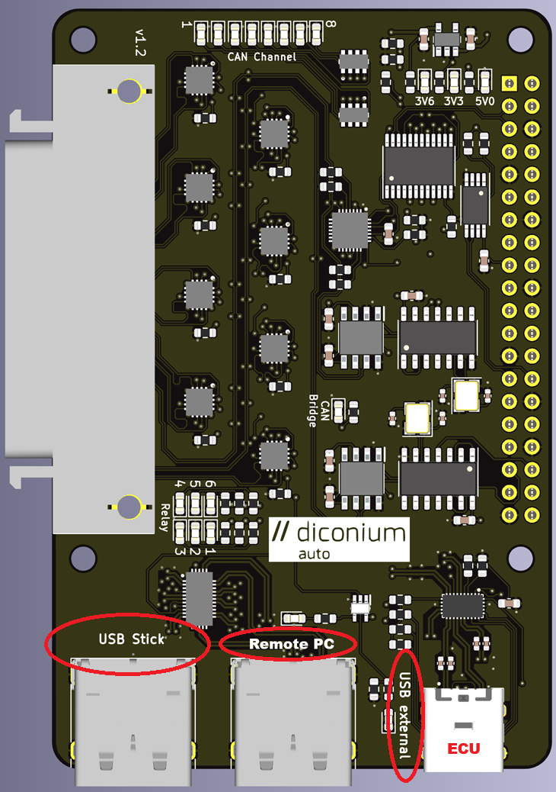

# Smart Updater (USB Switcher)
Automating Software Update for Windows PC - Test Bench (Guacamole Remote PC).

# Setup
Assuming CAN/USB Switcher setup is already established with Windows Test Bench and the Respective ECU. As shown in the below image, setup needs to be followed according to the Image shown below:



Windows PC and the CAN/USB Switcher (Connected with Raspberry Pi) are in the same newtwork.
- Raspberry Pi with Raspberry Pi OS Lite, with ssh enabled and connected to the network same as Windows PC - Test Bench (Guacamole Remote PC). Make note of IP Address of raspberry pi for the ssh communication to Raspberry Pi using the Windows PC.
- Windows PC - Guacamole Remote PC (Test Bench) is also connected to the same network as Raspberry Pi.
- USB-C port of CAN/USB Switcher is connected to AMI Box (ECU) using USB Cable.
- USB Stick with latest LUM update connected to USB Stick port of CAN/USB Switcher.

### Setup python virtual environment
Install python packages, listed below:
- pip install typer
- pip install filelock
- pip install smbus

As the raspberry pi and remote PC connected over same network, using ssh

### Copy LUM Update to Flash Drive

ssh login to to respberry pi, to execute the CAN/USB Swither script.
```
ssh pi@<ip_address_pi>
```

To switch the flash drive connected to CAN/USB Switcher to Windows PC
```
(pyenv) pi$ python3 ./app.py pc
```

### Connect USB Flash Drive to ECU to initiate Software Update

To switch the flash drive connected to CAN/USB Switcher to ECU
```
(pyenv) pi$ python3 ./app.py ecu
```
